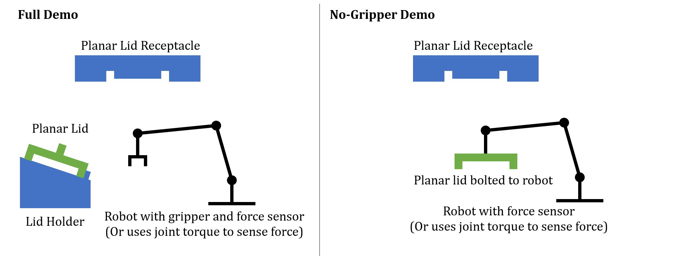
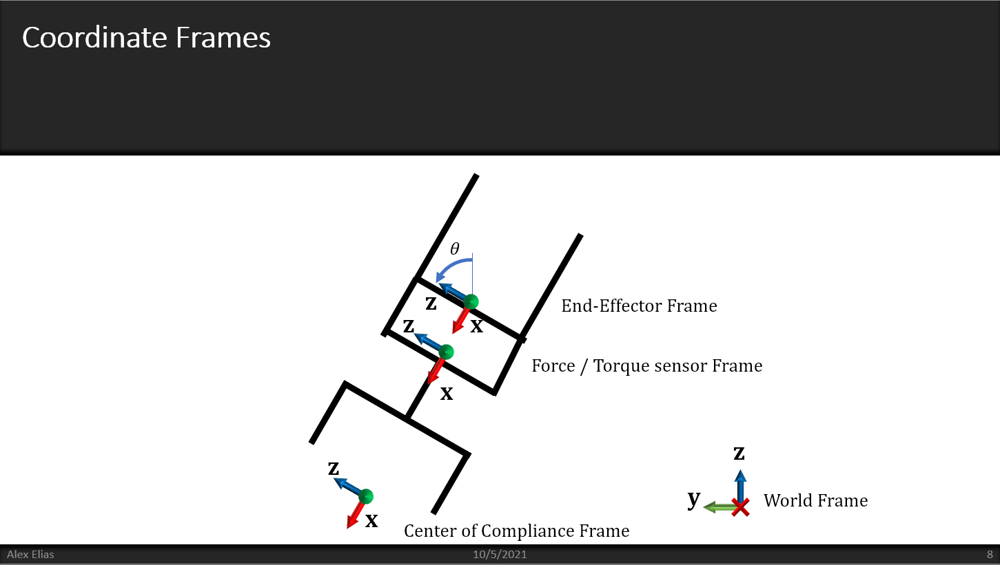
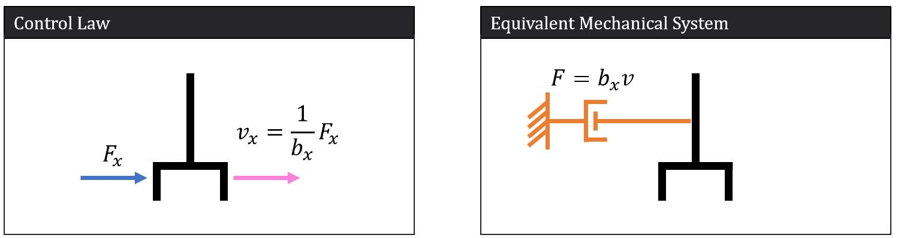
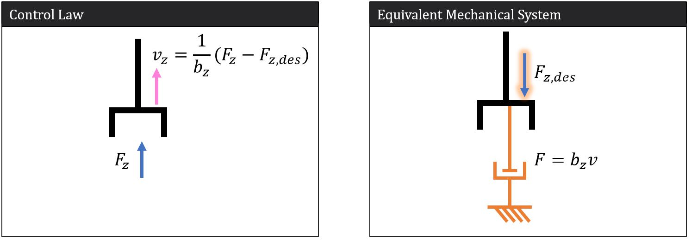
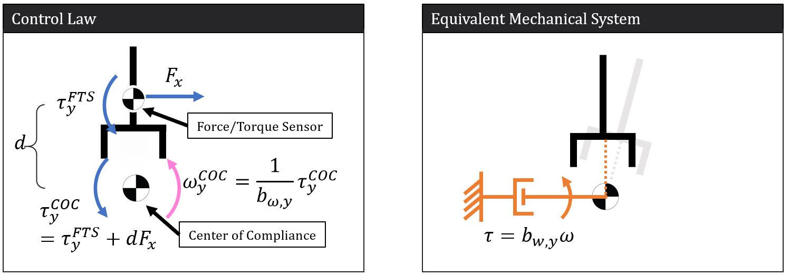

# ABB1200 Planar Compliance Control
This project is a mock-up setup for Mars Sample Return, where a three-link planar arm tries to push a lid in with 300N force. 

## Hardware Setup:
We're using ABB1200 with an ATI mini45 force sensor mounted between the robot end effector and the gripper.

## Software Requirements:
* Robot Raconteur
* Python3
* ABB1200 RR Driver
* Sensor Driver (included)

### Python Packages:
* general-robotics-toolbox
* qpsolvers
* BeatifulSoup4
* Numpy

## Compliance Control Setup

### Testbed setup

The robot motion is limited to its Y-Z plane, including translation in Y and Z axes and rotation around X axis. 
Robot end effector frame, sensor frame and TCP frame are set up in the same orientation.
The compliance control loop outputs Cartesian velocity, and passed into QP controller to execute the motion.

Damping increases as sensing force increases. Center of compliance stays on the same global horizontal level (changing in tool frame) during the motion.

